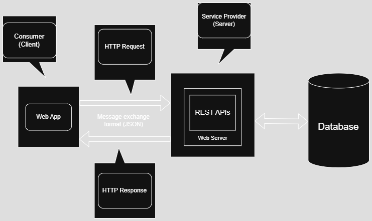
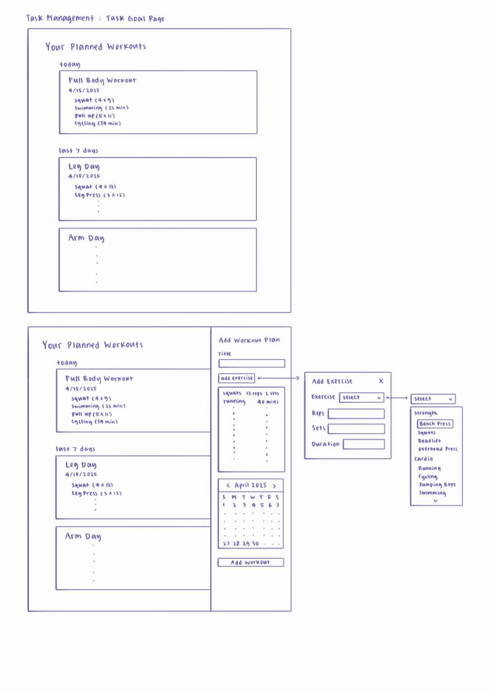
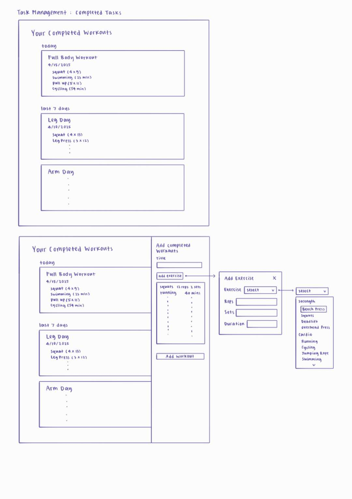
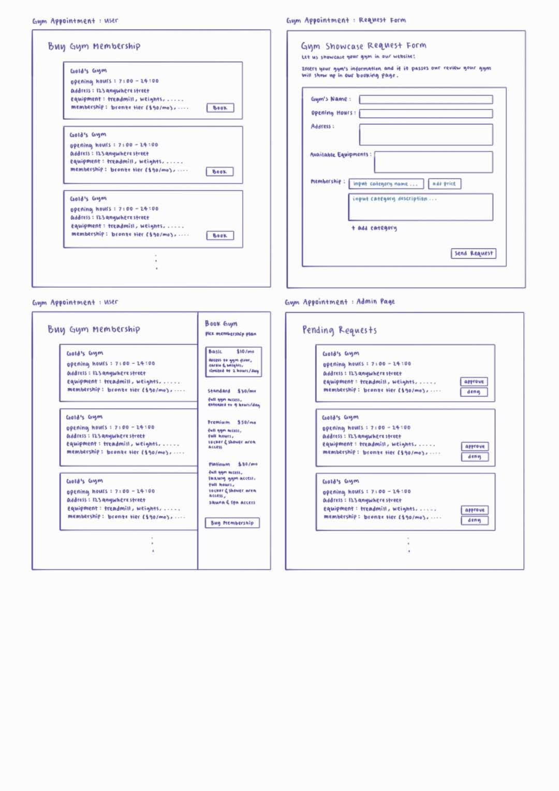
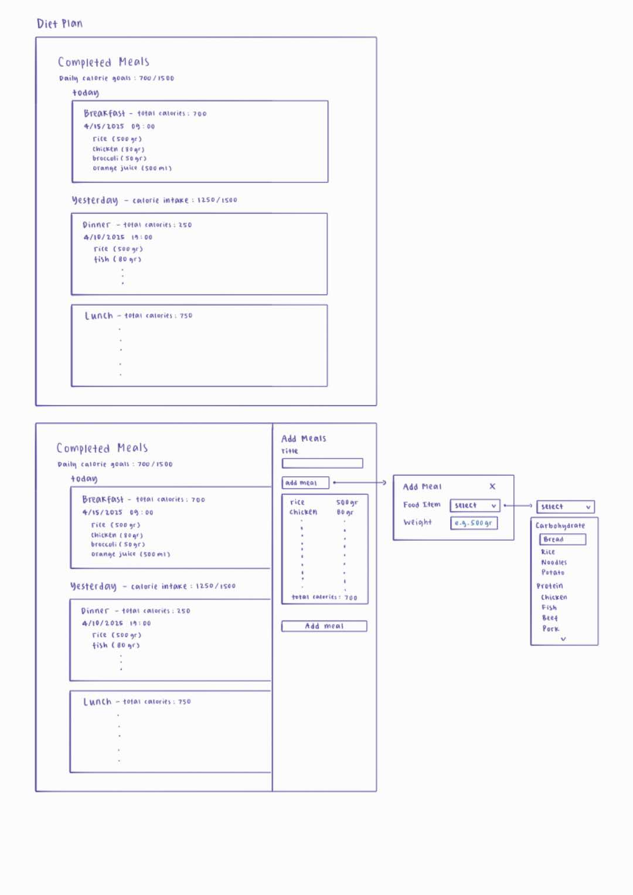
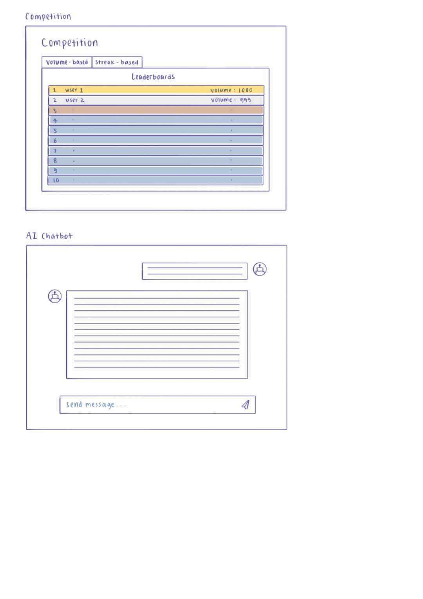

1. #### Architectural Design

​  

- ### Natural Language Description

  The software architecture for SUSTracker is a **monolithic, API-driven client-server architecture**, designed to support a web application while remaining flexible for future expansion to other client platforms, such as Android, iOS, and desktop applications(during summer break). This architecture is similar to the monolithic design of Stack Overflow, as discussed in lecture slide. It prioritizes a RESTful API backend to enable multi-platform compatibility. Below is a detailed explanation of the components, their roles, interactions, and the rationale for this design.

  #### Components and Their Roles

  1. **Frontend (React.js + Next.js)** : Combines the web client and web server, built with React and Next.js, to provide the primary user interface for **SUSTracker**. It renders dynamic content, such as scheduled workout lists and fitness dashboards, using React components for interactivity. Next.js handles both client-side rendering (CSR) in the browser and server-side tasks, such as server-side rendering (SSR) or static site generation (SSG), to optimize performance. It manages routing (e.g., /planned-workouts, /dashboard) and sends HTTP/HTTPS requests to the **Application Server** to fetch or update data via REST APIs, receiving JSON responses.
  2. **Application Server (Node.js + Express)**: The backend, built with Node.js and Express, provides a RESTful API (e.g., GET /api/planned-workouts, POST /api/tasks) that delivers JSON responses. Unlike server-side rendering architectures that send HTML pages, this server focuses on data processing and business logic (e.g., task management, fitness tracking) and communicates with clients via JSON.
  3. **Database (PostgreSQL)**: A relational database that stores structured data, such as user profiles, tasks, and fitness logs. Prisma, an ORM, simplifies database interactions with type-safe queries and schema management.
  4. **OAuth Service**: Handles user authentication via Google’s OAuth 2.0, generating tokens (e.g., JWT) that the Application Server verifies to secure API endpoints.

  #### Interactions

  - **Clients**  send HTTP/HTTPS requests to the **Application Server** to fetch or update data via REST APIs (e.g., GET /api/planned-workouts returns JSON data).
  - For the **Web Client**, the **Web Server (Next.js)** serves the UI and forwards API requests to the **Application Server**. Mobile and desktop clients will directly interact with the **Application Server** in future iterations.
  - The **Application Server** processes requests, using **Prisma** to query the **PostgreSQL Database** for data like planned-workouts, actual-workouts or fitness metrics.
  - For OAuth authentication, clients redirect users to the **OAuth Service**, which returns tokens to the **Application Server** for verification, ensuring secure access to protected endpoints.
  - JSON responses flow from the **Application Server** to the clients, enabling lightweight, platform-agnostic data exchange.

  #### Why This Architecture?

  This architecture is chosen for its **simplicity**, **flexibility**, and **extensibility**:

  - **Simplicity**: The monolithic design, with a single **Application Server** handling all backend logic, is straightforward to develop and maintain, making it ideal for a student project like SUSTracker with a limited timeline.
  - **Flexibility**: The REST API design, delivering JSON responses instead of HTML, decouples the backend from the frontend. This allows the same APIs to serve multiple clients (web, Android, iOS, desktop), supporting our plan to expand SUSTracker to mobile and desktop platforms during summer break.
  - **Extensibility**: The API-driven approach mirrors Stack Overflow’s monolithic architecture, which supports high traffic with a single backend.

  #### Hidden Assumptions

  - The diagram assumes reliable network connectivity; error handling for API or OAuth failures is necessary.
  - Security mechanisms (e.g., JWT validation, CORS) are not shown but critical for protecting APIs.

2. #### UI Design

- Task Management 

- Completed Tasks 

- Gym Appointment 

- Diet Plan 

  

- Competition 

